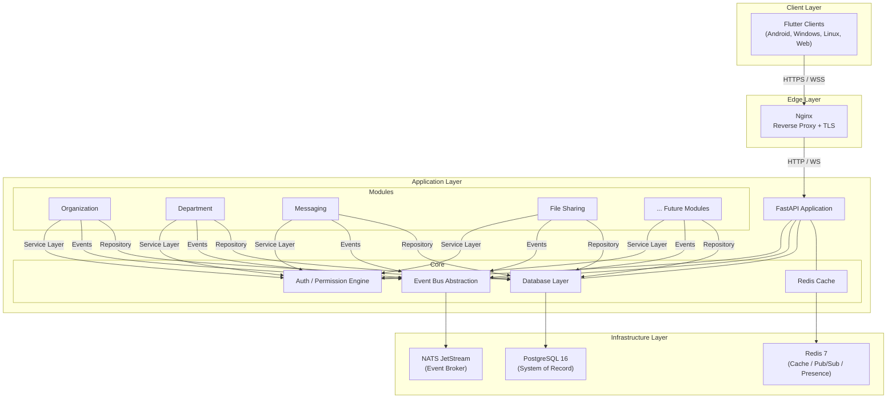

# ConnectHub Architecture

## System Overview

ConnectHub is a **modular monolith** — a single deployable application with strictly separated internal modules that communicate through well-defined interfaces.



## Dependency Flow

Strict unidirectional dependency flow — inner layers never depend on outer layers:

```
API (Routers) → Application (Services) → Domain (Models/Logic) → Infrastructure (Repositories/DB)
```

- **Routers** handle HTTP concerns only (parsing, validation, status codes)
- **Services** contain business logic, call the permission engine, emit events
- **Models/Domain** are pure Python — no framework or ORM dependencies
- **Repositories** abstract database access via SQLAlchemy

## Module Structure

Every module follows the same predictable structure:

```
modules/<module_name>/
├── __init__.py          # Module registration (register function)
├── router.py            # FastAPI APIRouter — HTTP endpoints
├── service.py           # Business logic layer
├── repository.py        # Data access layer (SQLAlchemy)
├── models.py            # SQLAlchemy ORM models
├── schemas.py           # Pydantic request/response schemas
├── events.py            # Event types published by this module
├── config.py            # Module-specific configuration (optional)
├── exceptions.py        # Module-specific exceptions (optional)
├── tests/               # Module-specific tests
│   ├── test_router.py
│   ├── test_service.py
│   └── test_repository.py
└── README.md            # Module documentation
```

## Module Isolation Rules

1. Modules **never import from each other** directly
2. Inter-module communication happens through:
   - The **event bus** (async, decoupled)
   - Well-defined **internal API contracts** (service interfaces)
3. Modules share **core infrastructure** only (database, events, auth, cache)
4. Each module registers its permissions with the **permission engine** at startup
5. A bug or failure in one module **must not cascade** to another

## Infrastructure Services

| Service | Role | Port | Container |
|:---|:---|:---|:---|
| PostgreSQL 16 | System of record — all persistent data | 5432 | `connecthub-postgres` |
| Redis 7 | Cache, session management, pub/sub, presence | 6379 | `connecthub-redis` |
| NATS 2.10 | Event broker — inter-module events, real-time fan-out | 4222 | `connecthub-nats` |
| Nginx 1.27 | Reverse proxy, TLS termination, rate limiting | 80/443 | `connecthub-nginx` |

## Security Architecture

- **Authentication**: JWT tokens (Phase 2)
- **Authorization**: Central Policy/Authorization service — data-driven, not hardcoded
- **Permission Evaluation**: Every service call passes through the permission engine
- **Data Visibility**: Query-layer filtering — unauthorized data is absent from results, not just hidden in UI
- **No Metadata Leakage**: 404 responses for both "doesn't exist" and "no permission" (Section 5)
- **TLS**: All external traffic encrypted via Nginx
- **Audit Logging**: Every privileged action recorded with who, what, when, where, and on what resource
