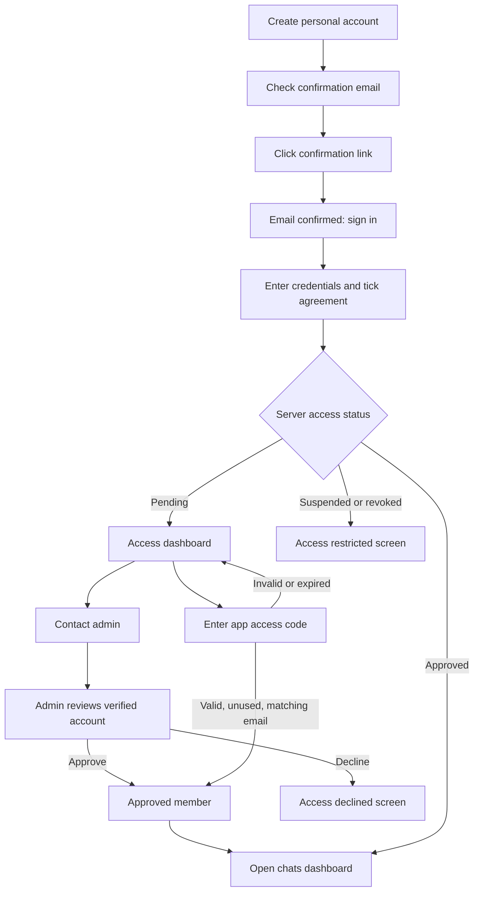

# KryinTalk account, signup, and access design

Status: proposed design for review. No app or live database changes are made by this document.

## 1. Product decision

KryinTalk is a chat app. Signup creates one person's account. It does not create a company, organization, workspace, server, group, or subscription. Professional branding does not change that product model.

The first release implements this flow:



Confirmation proves email ownership. Approval or an app access code grants permission to use the app. These are separate decisions.

## 2. Current implementation findings

Verified against the repository and a read-only Supabase Auth configuration request on 2026-09-26:

| Finding | Consequence | Planned correction |
| --- | --- | --- |
| Public signup trigger assigns an internal organization and grants a member role immediately | Newly created accounts have no approval boundary | Create a pending profile; grant member only on approval or code redemption |
| Signup sends `role: member` in user metadata | Encourages treating user-editable metadata as authority | Send only profile/consent input; role comes from server tables |
| Confirmation-required signup is returned as a failed login result | Successful signup appears as an error snackbar | Explicit registration outcomes and a confirmation screen |
| Missing profile can fall back to a fabricated member profile | Broken provisioning can look like valid membership | Fail closed with an account setup error and retry |
| Router checks authentication, not approval | Any signed-in account can enter app routes | Gate by verified identity, current consent, and current database access |
| Login agreement is checked on submission but button remains enabled | UI contradicts the user's requirement | Gray disabled button and the same guard for Enter |
| Auth listener primarily handles sign-out | Email callbacks/profile changes can leave stale state | Handle sign-in, refresh, callback, and sign-out deliberately |
| Existing `/join/:token` is a group invite | It is not an app-access or signup invite | Keep its group-only purpose; add separate app access codes |
| Admin user UI exposes create/edit/suspend actions; the cloud bridge has a GET users route but no matching writes | Controls may fail or refer to retired API behavior | Use authorized Supabase RPCs for the defined admin actions |
| Live Confirm Email is enabled; signup is enabled | Desired verification flow is available | Keep both settings |
| Live Site URL is `http://localhost:3000`; redirect allowlist is empty | Confirmation can return to the wrong app | Configure exact local and deployed callback URLs |
| Custom SMTP is not configured | Default Supabase email service is unsuitable for public signup | Configure a real sender before public release |
| Supabase minimum password length is 6; signup UI requires 8 | Password requirements differ | Set the project and UI to the same 8-character minimum |

The existing internal `organization_id` remains a private compatibility field for chat data partitioning. Signup never asks for it, accepts it as user authority, or creates an organization. Removing it from every legacy chat table is a separate migration and is unnecessary for this flow.

## 3. Global constraints

- Signup creates a personal account; no workspace, company, organization, server, or group creation fields.
- Production authentication, access decisions, storage, and admin actions use Supabase; no FastAPI fallback.
- Retain Flutter, Riverpod, GoRouter, existing icons, existing fonts, and AppTheme; add no UI framework dependency.
- Keep existing Terms and Privacy content; do not invent legal clauses.
- Never grant access or roles from client metadata, preferences, query strings, or JWT claims alone.
- Never log passwords, tokens, confirmation URLs, raw invite codes, hashes, or SMTP credentials; reveal an invite code only in its creator's one-time dialog.
- Preserve existing message ownership, reply navigation, HTML/code rendering, and Markdown attachment fixes.
- Public signup requires email confirmation before sign-in; approval never substitutes for confirmation.
- Every explicit password login requires an unchecked-by-default agreement checkbox; Enter follows the same rule.
- First release app codes are email-bound, single-use, valid for 7 days, and grant member access only.
- All protected data operations require the current database approval state, including storage and privileged RPCs.

## 4. Visual design

Use Watermelon/OriginKit-inspired spacing, form composition, focused controls, and clear dialogs, implemented as Flutter widgets using the existing theme. Their web components are reference material, not Flutter packages. The [official Watermelon platform](https://github.com/WatermelonCorp/watermelon-platform) uses React/TypeScript; [OriginKit's component documentation](https://www.originkit.dev/docs/components) describes web component usage.

Light mode uses cream `#FAF9F6`, charcoal `#1C1917`, teal `#0F766E`, muted text `#78716C`, and subtle emerald panels. Dark mode follows existing AppTheme dark surfaces. No unrelated purple gradients, fake customer testimonials, decorative statistics, or heavy animation.

Desktop at 960px and above: a restrained brand panel on the left and a form panel up to 480px wide on the right, within a centered 1120px layout. Brand panel: logo, "Good conversations start here.", and three factual steps: create an account, confirm your email, get access. Below 960px: logo/header and one form column; shorten the brand panel to a small introduction. At 360px: scroll naturally with 20px page padding and no horizontal overflow.

Inputs and buttons are at least 48px high; corners 12-16px; cards 24px. Use real labels above inputs, 8px field/helper spacing, 20px between field groups, and a subtle border instead of excessive shadows. Teal CTA uses white text; disabled CTA has a visibly gray fill and disabled semantics. Focus remains visible in both themes. Error text includes words/icons, not color alone. No long entrance animation; respect reduced motion.

Desktop composition:

```text
KryinTalk logo                      Already have an account? Sign in

Good conversations                 Create your KryinTalk account
start here.                        Your account is personal. Access is approved.

1 Create an account                Display name
2 Confirm your email               Username
3 Get access                       Email address
                                   Password                 [Show]
                                   [Password requirement box]
                                   Confirm password         [Show]
                                   [ ] I agree to the Terms and acknowledge
                                       the Privacy Policy.
                                   [       Create account       ]
                                   Confirm your email, then request access
                                   or enter a code from an admin.
```

## 5. Screen and button contracts

### Signup: `/register`

Heading: "Create your KryinTalk account". Helper: "Confirm your email, then get access from an admin or use an invite code."

| Control | Validation/state | Action |
| --- | --- | --- |
| Display name | Trim; 1-100 characters; no blank-only value | Stored as profile display name |
| Username | Trim optional leading `@`; lowercase; 3-100 letters, digits, underscores | Server validates and enforces uniqueness; helper shows normalized handle |
| Email address | Trim; email keyboard/autofill; do not modify password | Used by Supabase Auth; no account-existence disclosure |
| Password | Minimum 8 characters; preserve spaces and Unicode | Project password policy, matched by live requirement box |
| Confirm password | Exact match | Local validation only; not transmitted separately |
| Show/Hide password | Accessible toggle per password field | Switch visibility; preserve focus and input |
| Requirement box | Live rows: at least 8 characters; passwords match | Shows neutral/check/error states; no invented symbol/uppercase requirement |
| Agreement checkbox | Initially unchecked; never automatically checked | Enables CTA only when the form is valid |
| Terms / Privacy links | Keyboard-focusable inline links | Open corresponding existing content in accessible modal |
| Create account | Disabled gray until valid + checked; busy label "Creating account…" | One request; on success go to confirmation screen |
| Sign in | Available when not submitting | Go to `/login`; never creates an account |

Inline field errors appear after a field loses focus or a submission is attempted, not while entering the first character. Form-level errors appear above the CTA and remain readable. A disabled CTA has helper copy explaining the outstanding requirement. Enter submits only if the same `canSubmit` condition holds. Ignore repeated clicks/Enter while busy.

Duplicate email response uses Supabase-safe generic confirmation copy. Check username availability once on explicit submission with a scalar RPC that returns only a boolean, not a profile/directory. A known conflict gets "That username is unavailable. Choose another." Keep the database unique constraint for races. If a race or trigger failure still arrives as a generic Auth 500, show the database failure copy and retry path; never label every database failure as a username conflict.

### Check email: `/check-email`

Heading: "Check your email". Copy: "If this address can receive a new account confirmation, we've sent a link. Confirm your email, then sign in." Display the submitted email only in the current browser state; do not put it or a token into the URL.

| Button/link | State | Action |
| --- | --- | --- |
| Resend confirmation | Disabled for 60 seconds after sending; countdown; busy when resending | Supabase signup resend; generic result; obey server rate limit |
| Back to sign in | Always available unless a route transition is running | `/login` |
| Use another email | Available when idle | Return to signup; clear passwords; explain that changing input does not change an already-created account |
| Terms / Privacy | Available | Existing legal content |

Show "Check spam or junk folders" help. Refresh without transient email state shows a blank email field for resend rather than failing. No fake "Open email" button that guesses the user's mail provider.

### Email callback: `/auth/callback`

Use a real callback path reachable by the Flutter host, with SDK-supported session/link parsing before router guards run. Local target: `http://127.0.0.1:8080/auth/callback`; optional localhost alias: `http://localhost:8080/auth/callback`. The static host must fall back to `index.html` for that path. Configure the real deployed origin separately when it is known; never leave localhost as the production destination.

States: "Confirming your email…" → "Email confirmed" or "This confirmation link is invalid or has expired." Buttons: **Sign in**, or on error **Request another email** and **Back to sign in**. Remove token/code parameters from browser history once consumed. Do not display callback parameters in UI/debug logs.

A confirmation link may establish a temporary session through Supabase. Following the requested product flow, complete confirmation, clear that local session with local sign-out, and present the explicit sign-in CTA. This must not sign out other devices. It never approves the account. An existing approved user who opens a signup callback also sees a safe confirmation result, without a new approval.

### Login: `/login`

The existing Supabase path signs in with email, not username. Use the same branded form shell, inputs, spacing, and policy modal as signup. Heading: "Welcome back". Fields: "Email address", "Password". Do not advertise username login without a working resolver.

| Control | State | Action |
| --- | --- | --- |
| Show/Hide password | Available | Visibility toggle |
| Agreement checkbox | Unchecked at every explicit password login | "I agree to the Terms and acknowledge the Privacy Policy." |
| Sign in | Gray and disabled when blank, unchecked, or busy; busy label "Signing in…" | Authenticate, record consent, load server profile, then route by access |
| Create account | Available when idle | `/register` |
| Terms / Privacy | Available | Open readable modal; closing it does not check agreement |

The first and second explicit login both require the checkbox. Requiring it on every explicit login is the simple, consistent first-release rule; there is no unreliable browser-specific login counter. Restored sessions do not force a password login, but a missing/outdated recorded policy version goes to the consent screen before protected data starts. Remove "Keep me signed in" until its behavior is actually wired; Supabase's existing session persistence continues.

Incorrect credentials: "Incorrect email or password." Unconfirmed email: "Confirm your email before signing in" plus **Resend confirmation**. Network error: "Couldn't reach authentication. Check your connection and try again." Database/Auth 500: "Account sign-in is temporarily unavailable. Please try again." Preserve a redacted diagnostic category in developer/server logs. Never automatically fall back to FastAPI.

### Policy modal and restored-session consent: `/consent`

Terms/Privacy modal: title, scrollable text, close icon, **Close**; Escape closes, focus is trapped and restored. No mandatory scroll-to-bottom trick, no bundled marketing consent, no automatic ticking. Preserve existing content.

`/consent` uses the restricted auth layout: "Review the account terms", links to both documents, unchecked agreement, disabled **Continue** until checked, and **Sign out**. Continue records policy version `2026-09-26` server-side and refreshes the profile. If recording fails, remain here with **Retry**; protected providers remain stopped.

### Access dashboard: `/access`

This is the new user's dashboard until approved. It uses a restricted layout with logo, account email, and sign-out; no chats sidebar, user directory, messages, files, unread count, presence, or notifications.

Heading: "Your account is ready. Access is pending." Main copy: "Please contact an admin to allow access to KryinTalk, or enter an invite code." Step indicator: Account created ✓ → Email confirmed ✓ → App access pending.

| Control | State | Action |
| --- | --- | --- |
| Invite code | Plain text; trim outer spaces; preserve internal characters; max 128; paste allowed | Input for an app access code, not a group token |
| Activate access | Disabled when empty/busy; "Checking code…" while submitting | Redeem once server-side; refresh profile; approved → `/dashboard` |
| Contact admin | Available | Open dialog with account email/username and text to share; **Copy request details**, **Close**; optional contact email only if actually configured |
| Check status | Busy state; prevent duplicate requests; 10-second client cooldown | Refresh safe own-profile RPC; approved → `/dashboard`; no fake success |
| Sign out | Available, with busy state | Stop all subscriptions and clear local identity/session |

Contact details copy: "Please approve my KryinTalk account: [email], @[username]. My email is confirmed." No outbound message is sent by the app in this release. If an admin contact is unavailable, say "Ask the person who invited you to contact an administrator." Do not invent a support address.

Code errors use one safe message: "This code is invalid, expired, already used, or isn't assigned to this email." Network/server failures are separate and do not consume a code. Do not show pending users the list of admins or other users.

Check status on initial load, browser focus, and explicit button. No continuous polling or notification service just to show approval. While app is open, any access denial triggers a profile refresh and clears protected caches/subscriptions.

Declined: "Your access request was declined. Contact an admin if you think this is a mistake." Show only an explicitly public reason. Revoked/suspended: "Your access is restricted. Contact an admin for help." Disable invite redemption for those states. Buttons: **Contact admin**, **Check status**, **Sign out**. Admin reconsideration is required; an invite cannot bypass suspension/revocation/rejection.

### Admin: `/admin/users`

Reuse the user-management route with tabs **Access requests**, **Members**, **Invites**. Do not keep a password-based "Create user" dialog or a default password. Accounts belong to the people who sign up.

Access requests tab: default pending filter; search by name/username/email; statuses Pending, Declined, Approved, Suspended, Revoked; sort newest first; page size 25. Rows show name, handle, email, email-confirmed badge, created time, access status. Unverified signups can be viewed but cannot be approved. Pending count is server-authorized, never exposed publicly.

| Button/dialog | Action and guard |
| --- | --- |
| Review | Details dialog with verified identity, request date, status, roles, and relevant access history |
| Approve access | Confirmation: "Allow [name] to use KryinTalk as a member?" → **Approve access**, **Cancel**; verified pending account only; no automatic group membership |
| Decline request | Dialog: required public reason 1-500 characters → **Decline request**, **Cancel** |
| Reopen request | Declined/revoked account → pending after explicit admin review; no access granted |
| Suspend access | Members tab, required reason, explicit confirmation; admin can target ordinary members, superadmin can target admins |
| Restore access | Explicit review of suspended member; cannot silently grant a different role |
| Revoke access | Remove permission with a reason; respect target-role limits and last-superadmin protection |
| Change role | Superadmin only; choices Member or Admin for this flow; no self-promotion; protect last active superadmin |
| Create invite | Invites tab: required recipient email; displays fixed Member role, single use, 7-day expiry; **Create code**, **Cancel** |
| Copy code | One-time success dialog shows raw code; clipboard copy on user action; logs contain only invite ID |
| Revoke invite | Confirmation → invalidate unused code; used/revoked/expired rows have disabled action |
| Refresh | Reload current tab; loading, empty, and retry states visible |

No bulk approve, bulk deletion, password resets, email delivery automation, invite links, or organization management in this release. Existing group invitations remain separate. App invite links can be added after code redemption works; do not display an invite-link signup feature before it exists.

### Audit: `/admin/audit-logs`

Reuse the existing screen. Add filters for actor, target, date range, action, and outcome. Rows show readable action, actor, target, UTC timestamp with local display, reason, and event ID. Empty/loading/error states must be distinct. A drawer/dialog shows safe details. Ordinary members/pending accounts cannot read logs. Admin sees records within their permitted legacy partition; superadmin can inspect app-wide records.

## 6. Roles and boundaries

| Capability | Pending/restricted | Member | Admin | Superadmin |
| --- | --- | --- | --- | --- |
| Safe own account status, current consent, sign-out | Yes | Yes | Yes | Yes |
| Redeem app code | Verified pending only | No need | No need | No need |
| Chats/files/groups under existing membership rules | No | Yes | Yes | Yes |
| Review/approve/decline ordinary accounts | No | No | Yes, permitted partition | Yes |
| Create/revoke member access codes | No | No | Yes, permitted partition | Yes |
| Suspend/restore/revoke ordinary members | No | No | Yes, permitted partition | Yes |
| Manage admin roles or admin access | No | No | No | Yes |
| Grant superadmin | No | No | No | Trusted server operator bootstrap only in this release |
| Read app audit records | No | No | Permitted partition | App-wide |

Existing manager/group roles do not become app approval administrators. Existing group/channel access continues to apply after app approval. Approval is not permission to read every private conversation.

## 7. Data and server contract

Reuse `public.users`, `user_roles`, `roles`, and `audit_logs`. Add one table for app access codes. No second authentication system.

Users additions: `access_status` constrained to `pending|approved|rejected|revoked` (new signup default pending); `access_reviewed_at`, `access_reviewed_by` UUID FK to users, `access_reason` text up to 500; `policy_version` text and `policy_accepted_at`. Effective status is `suspended` when existing `is_suspended=true`; suspension overrides every allow condition. Existing inactive/deleted flags deny protected access too.

Use `has_verified_kryintalk_identity()` for onboarding RPCs: exact `auth.uid()`/profile UUID match, normalized current Auth/profile email match, confirmed Auth email, non-deleted profile. Its implementation reads trusted Auth state server-side, never client email claims alone. A restricted/inactive person may read their own safe status without reading anyone else's data.

Use `has_app_access()` for protected operations: verified identity, active/non-suspended/non-deleted profile, `access_status=approved`, and current recorded policy version. No dependency on RLS-protected helpers that recursively query each other. Server helpers get a fixed search path; PUBLIC/anon execute privileges revoked where unnecessary. Last-superadmin protection counts approved, verified, active, non-suspended, non-deleted superadmins even if a new policy version requires their renewed consent; a policy publication must not erase their protected role.

Own-profile RPC returns a whitelist: id, email, username, display_name, effective access status, safe public access reason, email-confirmed flag, policy version/date, active/suspended flags, approved roles, and existing allowed presentation fields. Never `to_jsonb(user)` as an unrestricted future-column export. Do not fabricate a member role for a pending profile. Identity mismatch returns a safe account setup failure.

| RPC | Inputs | Output/authorization |
| --- | --- | --- |
| `is_signup_username_available(p_username text)` | Normalized username; same 3-100 regex as signup | Anonymous/authenticated scalar boolean only; no email/identity/profile data |
| `get_current_user_profile()` | None | Safe own-profile JSON for confirmed matching identities, including pending/restricted status |
| `record_account_consent(p_version text)` | Exactly current version | Own matching verified account; writes consent and audit event |
| `list_app_accounts(p_status text, p_search text, p_limit int, p_offset int)` | Whitelisted status; trimmed search max 100; limit 1-100; nonnegative offset | Admin/superadmin only; server scope; `{items,total}` |
| `review_app_access(p_user_id uuid,p_action text,p_reason text)` | `approve|decline|reopen|suspend|restore|revoke`; reason required except approve/restore | Server checks actor, target role, current state, verified email, partition; lock target row; returns updated safe status |
| `set_app_account_role(p_user_id uuid,p_role text)` | `member|admin` only | Superadmin only; approved target; protect self and last superadmin; returns updated safe roles |
| `create_app_access_invite(p_email text)` | Valid normalized recipient email | Approved admin; generates random code, stores digest; `{id,code,expires_at}` exactly once |
| `list_app_access_invites(p_limit int,p_offset int)` | Bounded pagination | Admin-scoped metadata; no code or digest |
| `revoke_app_access_invite(p_invite_id uuid)` | Invite UUID | Authorized creator partition/superadmin; safe metadata |
| `redeem_app_access_invite(p_code text)` | Trimmed code max 128 | Verified pending self only; atomically consume code, approve member, record audit; returns own safe status |

`app_access_invites`: UUID id, unique SHA-256 code digest, normalized recipient email, internal partition ID copied from server actor, created_by, created_at, expires_at, redeemed_by, redeemed_at, revoked_at. Generate 24 random bytes and encode as unambiguous text; no short guessable numeric code. Single-use transaction locks the invite and target rows in a consistent order. Check expiry and revocation while locked. Code redemption never accepts a role/org/user ID from the caller.

Enforce 5 failed code attempts per account in 15 minutes server-side, using redacted `invite.redeem_failed` audit rows as the initial counter. Record only account/event time and outcome, never attempted code. Return a generic invalid-code result rather than raising after insert and rolling the counter back. Success/reuse races have exactly one success. Supabase Auth handles its own signup/login/resend rate limits; UI cooldowns complement these and do not replace them.

## 8. Database enforcement and realtime

Inventory every policy and exposed SECURITY DEFINER function before changing them. Extend the existing central access helpers with the approval/identity gate, and explicitly gate direct self policies that do not use those helpers. Cover users directory, memberships, messages/reactions, file attachments, friendships, notifications, audit logs, roles, organization records, storage.objects, and group invite RPCs. Public landing information must not reveal member data.

Onboarding has an intentionally narrow exception: safe own-profile/consent/redeem RPCs. Raw profile/table access is not the exception. Column grants must deny direct updates of access status, consent timestamps, organization, role, active/suspended/deleted flags, and reviewer fields. Server RPCs own those writes. Preserve private-chat/group membership checks alongside the global gate.

Review storage bucket privacy and signed URL lifetime. Revocation blocks new downloads, uploads, new subscriptions, and future authorized operations. Previously delivered messages/downloads cannot be recalled. Existing signed URLs remain valid until expiry; use 60-second URLs for protected files, and mint a fresh authorized URL when a user clicks download or retries expired media. Do not rely on an old cached URL or refresh every image on a timer. If a protected bucket is public, migrate it to private before claiming pending accounts cannot access files.

Do not send sensitive data over public broadcast/presence channels. Verify existing Realtime protocol and channel authorization. Dispose protected providers/subscriptions and clear user-scoped caches on logout/restriction/account switch. UI refreshes status on focus and on authorization denial; database checks apply even when an old tab still holds a token.

## 9. Logging

Supabase Auth already records authentication events; use [Auth audit logs](https://supabase.com/docs/guides/auth/audit-logs) for signup, login, email confirmation, password changes, and sign-out rather than inventing an unrelated browser log.

Write application audit events in the same server transaction as the action: `account.pending_created`, `account.consent_recorded`, `access.approved`, `access.declined`, `access.reopened`, `access.suspended`, `access.restored`, `access.revoked`, `role.changed`, `invite.created`, `invite.revoked`, `invite.redeemed`, and redacted `invite.redeem_failed`. Details include actor UUID, target UUID/invite UUID, old/new status or role, public reason where relevant, policy version, UTC timestamp, and outcome. Actor always comes from `auth.uid()` or a labeled trusted bootstrap operation.

Do not grant clients arbitrary audit insert/update/delete privileges. Existing exposed log-writing helpers must not allow a client to forge privileged events. Application logs are append-only for app roles. Failure logs contain a stable category and request/event ID where available; do not dump session objects. A failed transaction must not leave an approval without its audit event.

## 10. Migration and rollout

1. Snapshot catalog, relevant policies/functions, Auth settings, and aggregate identity alignment. Keep backups local; do not print credentials or message contents.
2. Validate current Auth/profile matches. Backfill existing active confirmed matching accounts as approved to preserve working demo access. Mismatched/orphan/legacy identities remain denied; do not remap message ownership to repair them.
3. Choose one correctly matched confirmed test account as bootstrap superadmin through a trusted operator migration; user has authorized managing fake test accounts. Log the change, validate sign-in, and protect the last active superadmin. Do not silently elevate a mismatched legacy profile.
4. In a disposable local Supabase/test database, run schema, trigger, gate, role, invite, and audit checks, then the Flutter auth/router UI checks.
5. Configure SMTP sender/DNS and exact callback URLs; use 8-character minimum on Supabase as well as UI. Confirm real mailbox delivery with a controlled test address. The [default SMTP limits](https://supabase.com/docs/guides/auth/auth-smtp) and [redirect configuration](https://supabase.com/docs/guides/auth/redirect-urls) are deployment requirements, not UI fixes.
6. Release compatible Flutter auth state/UI and SQL together in a short maintenance window. Old app builds fail closed on pending accounts. Build the final callback host before testing email links.
7. Verify two-account isolation and role boundaries in the running preview; inspect redacted Auth/database logs. Recheck reply jumps, literal `<h1>`, Markdown attachments, and uploads after auth changes.

An earlier broad identity-guard migration was rejected by automatic approval review. It is not deployed and must not be retried or bypassed as a shortcut. Prepare the precise reviewed migration and request the required live-operation approval if review still blocks it. Do not retrieve or place a service-role key in the browser.

If rollout fails, keep protected access closed and restore the compatible app/SQL backup together. Do not roll back by auto-approving every newly created pending account or disabling confirmation. Existing live SMTP credentials are external deployment input; no secret is stored in this design.

## 11. Acceptance criteria

- New signup never creates a workspace/group or grants a member/admin role before approval.
- Valid signup shows confirmation success; no false error snackbar and no premature dashboard access.
- Email arrives, returns to the running app, confirms once, and leads to explicit login; expired/reused links have recovery UI.
- Login/signup buttons are truly disabled gray until agreement and required inputs are valid; Enter cannot bypass them.
- Pending account sees its safe dashboard, can contact admin/copy details and redeem a valid email-bound code, and cannot read/write any protected app data via direct requests.
- Unverified, rejected, suspended, revoked, mismatched, and deleted identities cannot redeem their way around access controls.
- Admin can approve ordinary accounts; member/manager cannot; admin cannot grant admin or affect superadmin; last-superadmin protection is enforced server-side.
- Two simultaneous redemptions of one code produce one member approval and one safe failure; expired/revoked/wrong-email codes grant nothing.
- Consent/access/invite actions have immutable server audit events with no credentials or raw codes.
- Dark/light screens work at 360px, 768px, and 1440px and with keyboard/screen-reader semantics; dialogs trap/restore focus.
- Reloads, email links in a second tab, logout, account switching, network failure, schema error, and stale sessions do not leak old user state.

## 12. After the first release

Useful follow-ups, kept out of the initial approval feature: verified admin MFA, password recovery UI, admin email notifications, app invite links that preserve an invite across signup, and CAPTCHA if signup abuse appears. Add only working controls; no decorative buttons promising these features before their server flows exist.
